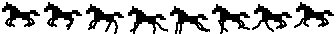

# Galoppierendes Pixel-Pferd

Marken-Asset für **Alpha-DJ-Engine**, abgeleitet vom Pferd der Wortmarke
(`assets/logo/Logo_Alpha_DJ_Engine.png`).

`preview.html` per Doppelklick öffnen — läuft ohne Server und ohne den Rest des
Projekts.

---

## Was drin ist

| Datei | Wofür |
|-------|-------|
| `horse-gallop.svg` | **Sprite-Streifen**, 8 Frames nebeneinander, je 42×34 Zellen. Die Fassung für Web — Vektor, skaliert verlustfrei, 18 kB. |
| `horse-gallop.gif` | Animiert, weißer Hintergrund. Für Slides, README, Social. |
| `horse-gallop-transparent.gif` | Dasselbe mit Transparenz. GIF kann nur 1-Bit-Transparenz — auf farbigem Grund kann es an den Kanten ausfransen, dann lieber die weiße Fassung oder das SVG. |
| `frames/horse-00…07.png` | Einzelframes, 336×272, transparent. Für Videoschnitt, After Effects, Game-Engines oder eigene Sprite-Sheets. |
| `preview.html` | Selbsterklärende Vorschau in drei Größen. |

---

## Einbinden (Web)

Das SVG ist ein **Sprite-Streifen**, kein fertiges Einzelbild. Der Container zeigt
genau ein Frame, der Streifen wandert in acht Schritten durch:

```html
<div class="horse"></div>
```

```css
.horse {
  --frames: 8;
  width: 240px;             /* frei wählbar */
  aspect-ratio: 42 / 34;    /* Seitenverhältnis EINES Frames */
  overflow: hidden;
}
.horse img {
  display: block;
  width: calc(var(--frames) * 100%);
  height: 100%;
  max-width: none;          /* sonst greift Tailwinds Preflight */
  image-rendering: pixelated;
  animation: horse-run .72s steps(var(--frames)) infinite;
}
@keyframes horse-run {
  from { transform: translateX(0); }
  to   { transform: translateX(-100%); }
}
```

Zwei Stolpersteine, beide im Projekt schon aufgetreten:

- **`max-width: none` nicht vergessen.** Tailwinds Preflight setzt `max-width:100%`
  auf jedes `img` und quetscht den Streifen sonst auf Containerbreite zusammen.
- **`aspect-ratio` gilt für ein Frame**, nicht für den ganzen Streifen.

Für einen ruhigen Auftritt bei `prefers-reduced-motion` die Animation abschalten —
dann steht Frame 0, die Schwebephase.

---

## Wie die Animation aufgebaut ist

Erzeugt von `src/build-horse.mjs` im Projekt-Root, nicht von Hand gezeichnet:

- **Rumpf** stammt 1:1 aus der Wortmarke, auf ein 19×9-Raster abgetastet und 2×
  hochskaliert. Kopf und Schweif bewegen sich bewusst **nicht** — eine Fassung mit
  nickendem Kopf und wedelndem Schweif wurde gebaut, direkt verglichen und
  verworfen, weil sie unruhiger wirkte.
- **Beine** werden pro Frame aus vier handgesetzten Posen gezeichnet: ausgreifen,
  aufsetzen, abdrücken, anziehen.
- **Gangfolge** ist ein Transversalgalopp mit vier Schlägen: Hinterhand einzeln,
  diagonales Paar, führende Vorhand, dann Schwebephase.

> **Schwebephase:** In Frame 0, 1 und 7 ist kein Huf am Boden — und die Beine sind
> dort **angezogen**, nicht gestreckt. Die gestreckte „Schaukelpferd"-Pose in der
> Luft ist der klassische Irrtum; Muybridge hat 1878 fotografisch gezeigt, dass die
> Schwebephase die gesammelte ist.

**Blickrichtung ist links.** Vorwärts bedeutet in allen Posen −x. Wer das Pferd
spiegelt, muss die Vorzeichen in `FORE` und `HIND` drehen, sonst laufen die Beine
rückwärts.

---

## Neu erzeugen

```bash
npm run build:horse
```

Stellschrauben in `src/build-horse.mjs`:

| Konstante | Wirkung |
|-----------|---------|
| `FORE`, `HIND` | Beinposen — Knie- und Hufversatz je Pose |
| `CYCLE` | Abfolge der Posen und `bob` (Federn des Rumpfs) je Frame |
| `SCALE` | Auflösung; 2 = Beine halb so grob wie die Logo-Pixel |
| `FRAMES` | Anzahl Frames — bei Änderung auch `--frames` im CSS anpassen |

Die Dateien in diesem Ordner werden davon **nicht** automatisch aktualisiert:
`horse-gallop.svg` hierher kopieren und GIF sowie Einzelframes neu exportieren.
